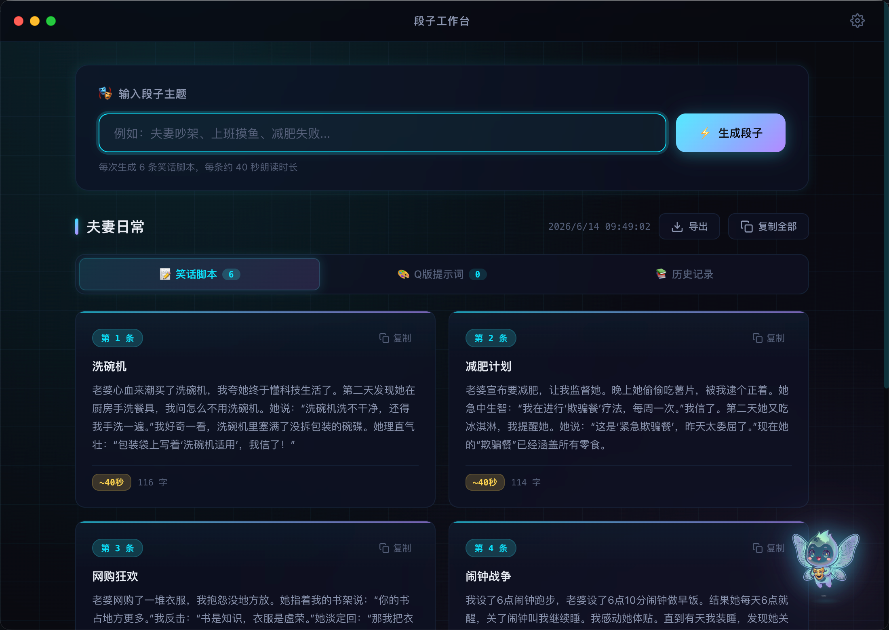

<p align="center">
  
</p>

<h1 align="center">段子工作台</h1>

<p align="center">
  一款基于 DeepSeek API 的桌面应用，一键生成笑话脚本 + Q版卡通提示词
  <br/><br/>
  <a href="#快速开始"></a>
  <a href="#快速开始"></a>
  <a href="#快速开始"></a>
  <a href="LICENSE"></a>
</p>

---

## 功能特性

- **AI 笑话生成** — 输入任意主题，自动生成 6 条约 40 秒朗读时长的笑话脚本（夫妻人设，铺垫-冲突-反转-爆点结构）
- **Q版卡通提示词** — 一键为每条脚本生成对应的英文 AI 绘画提示词（Midjourney / Stable Diffusion / DALL-E 通用）
- **本地存储** — 所有数据保存在本地 JSON，不经过任何第三方服务器
- **一键导出** — 支持导出 TXT、单条/全部复制到剪贴板
- **历史记录** — 自动保存每次生成的内容，可随时回看和加载
- **流式输出** — 实时显示 AI 生成进度，支持超时取消
- **科技感 UI** — 暗色主题 + 玻璃拟态 + 霓虹光效 + 浮动小精灵装饰

## 界面预览

<p align="center">
  
</p>

## 技术栈

| 组件 | 技术 |
|------|------|
| 框架 | Electron 31 |
| AI 模型 | DeepSeek `deepseek-v4-flash` |
| 数据存储 | electron-store + 本地 JSON |
| 打包工具 | electron-builder |
| 目标平台 | macOS Universal (Intel + Apple Silicon) / Windows x64 |

## 快速开始

### 环境要求

- **Node.js** >= 18
- **npm** >= 9
- **DeepSeek API Key** — 在 [platform.deepseek.com](https://platform.deepseek.com) 获取

### 开发运行

```bash
# 克隆项目
git clone https://github.com/andyjin215/joke-workstation.git
cd joke-workstation

# 安装依赖
npm install

# 启动开发模式
npm start
```

首次启动后，点击右上角 ⚙️ 齿轮图标进入设置，填入你的 DeepSeek API Key，即可开始使用。

### 打包 macOS .dmg

```bash
# 如果 GitHub 下载慢，设置国内镜像
export ELECTRON_MIRROR="https://npmmirror.com/mirrors/electron/"
export ELECTRON_BUILDER_BINARIES_MIRROR="https://npmmirror.com/mirrors/electron-builder-binaries/"

# 打包 Universal 版本（同时支持 Intel 和 Apple Silicon）
npm run build

# 仅 Apple Silicon
npm run build:arm

# 仅 Intel
npm run build:intel
```

### 打包 Windows .exe

```bash
# 在 macOS 上交叉编译 Windows 版需要安装 Wine（用于生成 NSIS 安装包）
brew install wine

# 打包 Windows x64
npm run build:win
```

> 注意：从 macOS 交叉编译 Windows 版存在一定限制，建议在 Windows 机器上打包以获得最佳兼容性。

打包产物在 `dist/` 目录下。

### 生成应用图标（如需重新生成）

```bash
# 从 sprite.png 生成 macOS 应用图标
mkdir -p build/icon.iconset
for size in 16 32 64 128 256 512; do
  sips -z $size $size assets/sprite.png --out "build/icon.iconset/icon_${size}x${size}.png"
  sips -z $((size*2)) $((size*2)) assets/sprite.png --out "build/icon.iconset/icon_${size}x${size}@2x.png"
done
iconutil -c icns build/icon.iconset -o build/icon.icns
rm -rf build/icon.iconset

# 从 sprite.png 生成 Windows 图标（需要 Python + Pillow）
python3 -c "
from PIL import Image
img = Image.open('assets/sprite.png')
img.save('build/icon.ico', format='ICO',
  sizes=[(16,16),(24,24),(32,32),(48,48),(64,64),(128,128),(256,256)])
"
```

## 项目结构

```
joke-workstation/
├── main.js                 # Electron 主进程（窗口管理、IPC、本地存储）
├── preload.js              # 安全桥接层（contextBridge）
├── package.json            # 项目配置 + electron-builder 打包配置
├── assets/
│   ├── sprite.png          # 小精灵吉祥物
│   └── screenshot.png      # 界面预览截图
├── build/
│   ├── icon.icns           # macOS 应用图标
│   └── icon.ico            # Windows 应用图标
└── src/
    ├── index.html          # 主界面
    ├── settings.html       # 设置页面
    ├── css/
    │   └── style.css       # 暗色科技感主题样式
    └── js/
        ├── renderer.js     # 核心逻辑：API 调用、段子/提示词生成
        └── settings.js     # 设置页逻辑 + 连接测试
```

## 使用说明

1. **生成段子** — 在输入框填写主题（如"夫妻吵架""上班摸鱼"），点击「生成段子」
2. **查看脚本** — 生成完成后自动展示 6 张脚本卡片，可单条复制
3. **生成提示词** — 点击「一键生成 Q 版卡通提示词」，为每条脚本配图
4. **导出 / 复制** — 点击顶部的导出或复制按钮，保存为 TXT 或复制到剪贴板
5. **历史记录** — 切换到「历史记录」Tab，查看和加载之前的创作

## 安全设计

- **contextIsolation: true** — 渲染进程无法直接访问 Node.js API
- **nodeIntegration: false** — 禁用渲染进程的 Node 集成
- **CSP 策略** — 限制脚本来源和 API 连接地址
- **路径穿越防护** — 文件操作使用 `path.basename` 校验
- **无后端** — 所有数据仅存储在用户本地

## 参与贡献

欢迎提交 Issue 和 Pull Request！详见 [CONTRIBUTING.md](CONTRIBUTING.md)。

## 许可证

[MIT](LICENSE) — 自由使用、修改和分发。
